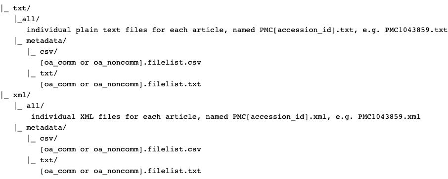

<!-- README.md is generated from README.Rmd. Please edit that file -->

```{r, include = FALSE}
knitr::opts_chunk$set(
  collapse = TRUE,
  comment = "#>",
  fig.path = "man/figures/README-",
  out.width = "100%"
)
```

# PMCfetchR

<!-- badges: start -->
<!-- badges: end -->

## Why cares? 

This package was developed out of frustration with how long it took me to read through NCBI's [documentation](https://www.ncbi.nlm.nih.gov/pmc/tools/textmining/) for extracting Open Access Articles Dataset to finally partially understand how to do it. Considering that the FTP service will be discontinued in March 2022 in favor of the new cloud-based access, hosted on and [AWS S3 Storage Bucket](https://registry.opendata.aws/ncbi-pmc/), I determined this package would utilize the AWS S3 REST API to extract full-text articles. Why? Because they are useful for text-mining/NLP related projects. 

## Installation

You can install the development version from [GitHub](https://github.com/) with:

``` r
# install.packages("devtools")
devtools::install_github("labouz/PMCfetchR")
```
## Getting PMCIDs

The basic structure of the PMC Open Access Subset is as follows:  



Notice that the API's URL requires the PMCID of a specific article you want to retrieve. Let's say I have identified articles I would like to analyse but only have their PMIDs. I can convert them with the `fetch_pmcid()` function:

```{r char-vec}
library(PMCfetchR)

my_pmcids <- fetch_pmcid(c("27576877", "29497878", "31652369", "21282321", "31693845"))
```

What is special about `fetch_pmcid()` is that you can mix and match what you input. You can pass in a character vector of PMIDs as we did above or a string of individual PMIDs as `charachter` or `integer`:

```{r string}
my_pmcids <- fetch_pmcid(27576877, 29497878, "28626478", 21282321, "31693845")

```

Note that this function will return 'invalid' for PMIDs that do not have associated PMCID. This likely means that the corresponding journal has not yet submitted the article's full text XML (article is < 3 months old) or too old (older than 2005).

## Getting Full Text Articles

You can then use the resulting list, or your own vector of PMCIDs, to the `fetch_fulltext()` function to get a tidied data frame of each article tokenized by sentence.

```{r fulltext}
my_articles_df <- fetch_fulltext(my_pmcids)
```
The function will print a message to the console if a particular PMCID article is not found in each of the three AWS S3 Bucket directories.

> NOTE: Due to copyright, some PMCIDs may only return the Title and Abstract.

## Acknowledgements:

Developing this package would be a lot more work if not for the [tidypmc](https://cran.r-project.org/web/packages/tidypmc/index.html) package.

Chris Stubben (2021). tidypmc: Parse Full Text XML Documents from PubMed
  Central. https://docs.ropensci.org/tidypmc,
  https://github.com/ropensci/tidypmc.


